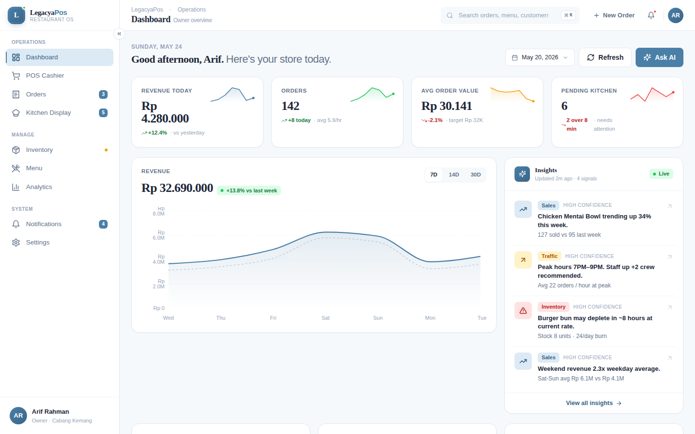
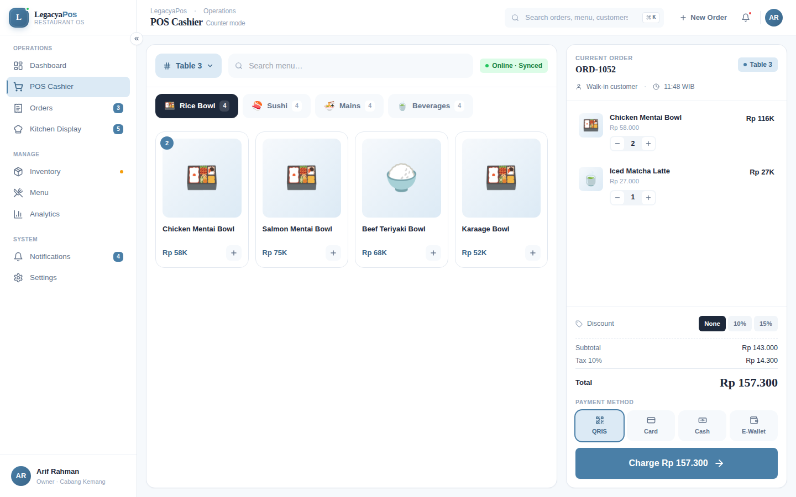
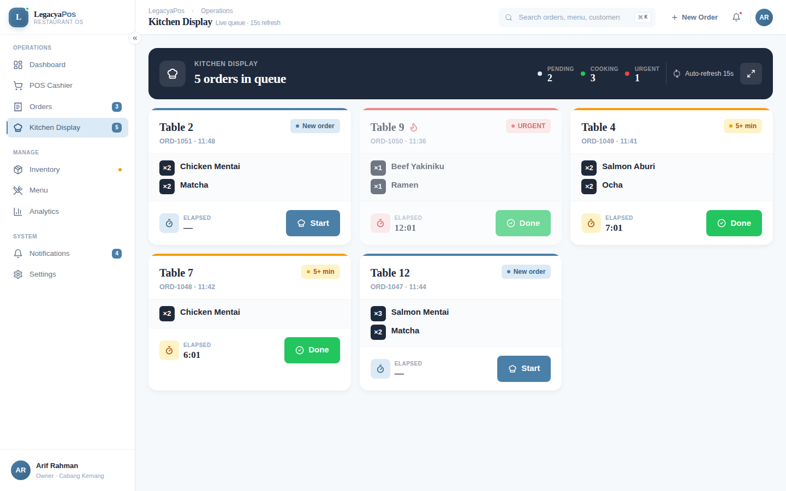

# LegacyaPos — Restaurant POS with AI Insights

> A portfolio-grade restaurant Point-of-Sale dashboard demonstrating **enterprise SaaS UI craft**, **multi-role product thinking**, and **AI-augmented decision support** — built end-to-end as 9 production-quality screens.

<div align="center">


</div>

---
## 🔗 Live Demo
https://legacya-pos-ui-129q.vercel.app

---

## ✦ Screenshots

<div align="center">
  
  &nbsp;
  
  &nbsp;
  
</div>

<div align="center">
  <sub><b>Dashboard</b> — owner overview · &nbsp; <b>POS Cashier</b> — two-pane tablet layout · &nbsp; <b>Kitchen Display</b> — live urgency queue</sub>
</div>

---

## ✦ Why this project exists

Most "POS UI" mockups stop at a pretty dashboard. LegacyaPos is built to demonstrate **product depth** — three distinct user roles, real interaction patterns, AI-informed actions, and 9 fully designed screens that share one cohesive design system.

It is intentionally scoped to be **shippable**, not just renderable.

---

## ✦ The three personas

| Persona | Device | Priority screen | Constraint |
|---------|--------|-----------------|------------|
| 🧑‍💼 **Owner** | Desktop / mobile | Dashboard · Analytics | Decisions in <2 min |
| 🧾 **Cashier** | Tablet landscape | POS Cashier | Complete order in <30 sec |
| 👨‍🍳 **Kitchen** | Wall-mounted display | Kitchen Display | Readable from 2 meters |

Every screen was designed around one of these jobs-to-be-done — not as a generic "admin panel."

---

## ✦ The 9 screens

| # | Screen | Phase | Signature detail |
|---|--------|-------|------------------|
| 1 | **Dashboard** | 2 | AI insight panel · sparkline stat cards · w-o-w revenue comparison |
| 2 | **POS Cashier** | 2 | Two-pane tablet layout · 44px tap targets · single-tap discount pills |
| 3 | **Orders List** | 2 | Expandable rows with receipt actions · status filter w/ live counts |
| 4 | **Kitchen Display** | 2 | Urgency-based ring colors · live elapsed timer · 10min+ pulse alert |
| 5 | **Inventory** | 3 | Stock bar viz · ETA-out predictions · AI prediction banner |
| 6 | **Menu Management** | 3 | Grid/list view toggle · hover-reveal actions · inline availability switch |
| 7 | **Analytics** | 3 | **Hour × Day heatmap** (signature viz) · category donut · payment mix |
| 8 | **Notifications** | 4 | Time-grouped feed · multi-channel preferences · digest sidebar |
| 9 | **Settings** | 4 | Internal sidebar nav · **live thermal receipt preview** · sticky save bar |

---

## ✦ Design philosophy

**Enterprise fintech, not generic admin template.**

- 🎨 **Light theme only**, deliberate whitespace, soft shadows, rounded-2xl cards
- 📐 `tabular-nums` everywhere numbers appear — fintech-grade alignment
- 🎯 **Three card variants** by context (KPICard, StatChip, MenuStat) — not one-size-fits-all
- 🪶 **Custom components over libraries** where it matters (heatmap, sparklines, receipt preview) — keeps bundle lean and design ownership tight
- 🤖 **AI insights as a cohesive panel** with confidence indicators — not isolated cards spitting vague advice

### Color tokens

```css
--primary:       #4A7FA7    /* enterprise blue */
--primary-soft:  #DCEAF5    /* tints, active states */
--bg:            #F6F9FC    /* canvas */
--text-main:     #1E293B    /* slate-800 */
--text-soft:     #64748B    /* slate-500 */
--success:       #22C55E
--warning:       #F59E0B
--danger:        #EF4444
```

### Typography

- **Display:** Plus Jakarta Sans (600–700) — headings, numbers
- **Body:** Inter (400–500) — UI text, descriptions

---

## ✦ Tech stack

| Layer | Choice | Why |
|-------|--------|-----|
| UI | React 18 | Industry baseline |
| Build | Vite | Fast HMR, ESM-native |
| Styling | Tailwind CSS | Utility-first, no component library bloat |
| Charts | Recharts | Composable, theming-friendly |
| Icons | Lucide React | Consistent stroke, premium feel |
| State | `useState` + `useMemo` (Zustand-ready) | Minimum surface area, easy to extract |
| Data | Mock JSON / local constants | No backend required to demo |

---

## ✦ Repo structure (recommended)

```
legacyapos/
├── README.md
├── LICENSE
├── .gitignore
└── artifacts/
    ├── 01-foundation.jsx          # Phase 1 — design system + shell
    ├── 02-dashboard.jsx           # Phase 2 — owner dashboard
    ├── 03-operations.jsx          # Phase 2 — POS + Orders + Kitchen
    ├── 04-management.jsx          # Phase 3 — Analytics + Inventory + Menu
    └── 05-system.jsx              # Phase 4 — Notifications + Settings
```

> Each artifact is a self-contained React component runnable in any Vite + Tailwind project. Drop into `src/App.jsx`, install deps (`recharts`, `lucide-react`), and it renders.

---

## ✦ User scenarios driving the design

**Scenario A — Cashier flow (target: <30 sec)**
> Open POS → select table → add 3 menu items → apply 10% discount → confirm payment → print receipt.

**Scenario B — Owner morning check (target: <2 min)**
> Open dashboard → check yesterday's revenue → read AI insights → check inventory alerts → review top menu.

**Scenario C — Kitchen flow (live, hands-free)**
> Order arrives → display auto-updates → tap "Start Cooking" → tap "Done" → order disappears from queue.

---

## ✦ AI insights system

AI is rendered as a **cohesive panel**, not isolated cards. Every insight has:

- 🏷️ Category tag (Sales / Inventory / Traffic)
- 📰 Single-line headline
- 📊 Supporting data point
- ✅ Confidence indicator (High / Medium)

**Tone:** data-confident, concise, actionable. No vague fluff.

> Example: _"Burger bun may deplete in ~8 hours at current burn rate. Stock 8 units · 24/day burn."_ — High confidence

---

## ✦ Status

**Phase 1 — Foundation** ✅
Design tokens, typography, base components, layout shell, mock data

**Phase 2 — Operations** ✅
Dashboard, POS Cashier, Orders, Kitchen Display

**Phase 3 — Management** ✅
Analytics, Inventory, Menu Management

**Phase 4 — System** ✅
Notifications, Settings

**Roadmap (optional)**
- ✅ Bundle as full Vite project with Zustand store & React Router
- ✅ Deploy live demo (Vercel)
- 🔲 Full case study write-up
- 🔲 Loom walkthrough

---

## ✦ How to run an artifact locally

```bash
# create vite project
npm create vite@latest legacyapos -- --template react
cd legacyapos

# install deps
npm install
npm install recharts lucide-react

# add tailwind (follow https://tailwindcss.com/docs/guides/vite)

# drop one of the artifact files into src/App.jsx
# then:
npm run dev
```

---

## ✦ Credits

Designed & built by **[Yoga P. Effendi](https://github.com/legacyasphere-id)** — AI fullstack designer-engineer.

Built with intentional care for taste, hierarchy, and the boring details (spacing, alignment, transitions) that separate generic admin UIs from real products.

> _If you're hiring or want to collaborate, find me at [github.com/legacyasphere-id](https://github.com/legacyasphere-id)._

---

<div align="center">

**LegacyaPos** · Restaurant OS · 2026

</div>
